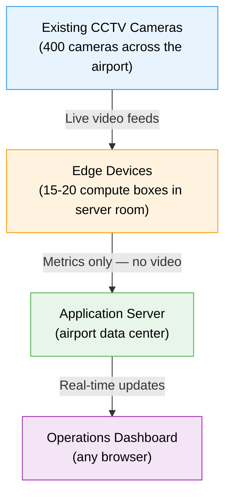

# Airport Queue Intelligence: Product Requirements

> **Executive Summary:** Airport Queue Intelligence transforms existing CCTV infrastructure into a real-time queue monitoring and prediction platform. Without installing any new hardware at gates or counters, the system provides operations staff with live wait times, queue lengths, throughput metrics, and forward-looking predictions — enabling data-driven staffing decisions that reduce passenger wait times and improve the overall airport experience.

---

## 1. What This System Does

Airport Queue Intelligence turns existing CCTV camera feeds into real-time queue metrics and forward-looking predictions for operations staff. No new hardware at gates or counters. No manual counting. The system watches every queue in the airport and tells operators what's happening right now and what's coming next.

Operators see a live dashboard showing, for every queue zone in the airport:

- How many people are waiting
- How long they've been waiting (average and worst-case)
- How fast the queue is moving (throughput per hour)
- How long service takes at the counter
- When to open another counter before the queue gets out of hand
- Predicted queue lengths and wait times for the next 30 minutes, 4 hours, 7 days, and 30 days

The system runs computer vision on edge devices deployed on-premise. The application server runs in the airport's own data center or private cloud. All data stays within the airport network.

### System Overview

---

## 2. Why This Matters

Airport queues are managed by gut feeling. Staff walk the terminal, eyeball the lines, and decide when to open counters. This doesn't scale. It's reactive. By the time someone notices a queue is too long, passengers are already frustrated.

This system gives operations a single screen that shows every queue in the airport, with numbers updated every second. Staff can see a queue building before it becomes a problem. They can compare lanes and rebalance. They can measure the effect of adding a counter. Over time, the historical data shows patterns: which lanes are slowest, which times of day spike, which counters need more staff.

The value is simple: shorter waits, better staffing, fewer complaints, and data to back up operational decisions.

---

## 3. How It Works (Non-Technical Overview)

### 3.1 Existing Cameras, No New Hardware

The airport already has hundreds of CCTV cameras covering check-in counters, security lanes, immigration desks, gate boarding areas. This system connects to those camera feeds over the existing network. Nothing is installed at the gate or counter.

### 3.2 Edge Devices Process the Video

Small compute boxes (roughly the size of a thick laptop) are deployed in the airport's server room. Each box handles 30-40 camera feeds. For 400 cameras, 15-20 boxes are needed.

Each box:
- Receives live video from its assigned cameras
- Detects and counts people in defined queue and service areas
- Tracks individuals across frames to measure how long each person waits
- Computes queue length, wait times, processing times, and throughput

The boxes only send numbers to the cloud. No video leaves the airport.

### 3.3 Cloud Dashboard Shows Everything

A web application (accessible from any browser) displays live metrics for every queue zone across the airport. Operations staff see a single screen with the entire airport's queue status. They can drill into a specific terminal, a specific security checkpoint, or a specific lane.

---

## 4. Concepts

### 4.1 Zone

A **zone** is the core unit of the system. It represents one physical queue and its associated service counter.

Examples:
- "Terminal A Security Lane 3"
- "Terminal B Check-in Counter A"
- "Gate C4 Boarding Queue"
- "Immigration Desk Row 2"

Each zone has:
- A **queue area** (where people wait)
- A **service area** (where people are being served at the counter/desk)
- A **name** that operators recognize
- **Alert thresholds** (e.g., alert if queue > 15 people, or wait > 5 minutes)

One camera can cover multiple zones. For example, a single overhead camera might see two adjacent check-in counters. Each counter is a separate zone with its own queue area and service area.

### 4.2 Area

An **area** is a logical group of zones. It maps to a physical section of the airport.

Examples:
- "Terminal A Security" (contains Lane 1, Lane 2, Lane 3, Lane 4, Lane 5)
- "Terminal B Check-in" (contains Counter A, Counter B, Counter C, Counter D)
- "Gate C Boarding" (contains Gate C1, Gate C2, Gate C3, Gate C4)
- "Arrivals Immigration" (contains Desk Row 1, Desk Row 2, Desk Row 3)

Areas let operators see the aggregate picture: "Terminal A Security has 85 people queuing with an average 4-minute wait."

### 4.3 Camera

A camera is a physical CCTV device. It feeds one or more zones. Operators generally don't interact with cameras directly. They work with zones.

If a camera is replaced or moved, the zone keeps its identity and history. The zone is permanent. The camera is infrastructure.

### 4.4 Edge Device

An edge device is a compute box in the server room. It handles 30-40 cameras. Operators don't interact with edge devices directly. They are managed by IT/infrastructure staff via an admin panel.

If an edge device fails, its cameras are automatically reassigned to other edge devices. Zones continue working with a brief interruption (~1 minute).

---

## 5. Metrics

### 5.1 Per-Zone Metrics (Real-Time)

| Metric                        | What It Means                                                                          | Update Rate  |
| ----------------------------- | -------------------------------------------------------------------------------------- | ------------ |
| **Queue Length**               | Number of people currently standing in the queue area                                  | Every second |
| **Average Wait Time**          | How long people currently in the queue have been waiting, on average                   | Every second |
| **Predicted Wait**             | Estimated wait time for someone joining the queue right now, based on current throughput | Every second |
| **Wait Time P50**              | Half of completed waits were shorter than this (median)                                | Every second |
| **Wait Time P90**              | 90% of completed waits were shorter than this (worst-case typical)                     | Every second |
| **Service Count**              | Number of people currently being served at the counter/desk                            | Every second |
| **Average Processing Time**    | How long service takes per person, on average                                          | Every second |
| **Throughput**                 | People served per hour at this zone                                                    | Every second |

### 5.2 Per-Area Aggregates

| Metric              | What It Means                                              |
| -------------------- | ---------------------------------------------------------- |
| **Total Queue**      | Sum of queue lengths across all zones in this area         |
| **Average Wait**     | Weighted average wait time across all zones                |
| **Total Throughput** | Sum of throughput across all zones                         |
| **Busiest Zone**     | The zone with the longest queue or highest wait            |
| **Alert Count**      | Number of active (unacknowledged) alerts in this area      |

### 5.3 Airport-Wide Summary

| Metric                | What It Means                                        |
| ---------------------- | ---------------------------------------------------- |
| **Total Queuing**      | Total people waiting across the entire airport       |
| **Average Wait**       | Airport-wide average wait                            |
| **Total Throughput**   | Airport-wide people served per hour                  |
| **Active Alerts**      | Total unacknowledged alerts                          |
| **Edge Fleet Status**  | How many edge devices are online (admin)             |

### 5.4 Custom Metrics (User-Defined)

Operators can define their own composite metrics by combining data from multiple zones. This lets the airport track numbers that matter to their specific operations without code changes.

**How it works**: pick an aggregation (sum, average, max), pick a source field (queue_length, service_exits, throughput, etc.), and pick which zones to include (by area, by tag, or by explicit list).

**Examples:**

| Custom Metric                      | Definition                                                               |
| ---------------------------------- | ------------------------------------------------------------------------ |
| **Total Pax Arrived**              | Sum of `service_exits` across all zones tagged "arrivals"                |
| **Total Pax Departed**             | Sum of `service_exits` across all zones tagged "departures"              |
| **Terminal A Total Queuing**       | Sum of `queue_length` across all zones in area "Terminal A"              |
| **Security Throughput Rate**       | Sum of `throughput_per_hour` across all zones tagged "security"          |
| **Worst Wait Anywhere**            | Max of `avg_waiting_time_s` across all zones                             |
| **Check-in Counter Utilization**   | Avg of `service_count` across all zones in area "Terminal B Check-in"    |

Custom metrics:
- Update in real-time (every second), computed from the same live zone data
- Have historical values stored in the database, just like zone metrics
- Can be displayed on the airport overview or area views
- Can be exported to CSV
- Can be used in predictions (the prediction engine runs on custom metrics too)
- Are configured through the dashboard, no code changes needed

### 5.5 Measurement Methodology

This section explains how the core metrics are derived from the computer vision pipeline.

**Average Wait Time** is the average dwell time of tracked persons within the queue polygon. The system assigns a unique track to each person detected in the queue area and measures how long that track persists. When persons exit the queue polygon (moving to the service area or leaving), their total dwell time is recorded as a completed wait.

**Single-camera tracking.** Each zone is monitored by exactly one camera. Person tracks are maintained per-camera — the system does not perform cross-camera tracking. This means each zone's metrics are self-contained and independent.

**Accuracy considerations.** Overhead (top-down) camera angles yield the best tracking accuracy because they minimize occlusion — people blocking one another from the camera's view. Oblique or side-on camera angles may produce less precise counts in dense queues due to overlapping bodies.

**Known limitation.** If a person briefly leaves the camera's field of view (e.g., steps behind a pillar or moves to the edge of the frame), their track resets. The system treats them as a new person when they reappear. This can cause slight underestimation of individual wait times in zones where the camera view has obstructed areas.

**Future capability.** Cross-camera person re-identification is a planned enhancement. Once available, it would enable true end-to-end measurement — tracking a passenger from the moment they join a queue to the moment they complete service — even across multiple camera views. This would also support scenarios like serpentine queues that span more than one camera.

---

## 6. Predictions

The system predicts future queue states based on historical patterns. Predictions run on the cloud server using the accumulated metrics data in TimescaleDB. The longer the system runs, the better the predictions get.

### 6.1 What Gets Predicted

| Predicted Metric         | Description                                                          |
| ------------------------ | -------------------------------------------------------------------- |
| **Queue Length**          | Expected number of people in the queue at a future time              |
| **Wait Time**            | Expected average wait time at a future time                          |
| **Processing Time**      | Expected average service time at a future time                       |
| **Throughput**           | Expected people served per hour at a future time                     |
| **Airport Pax Count**    | Total expected passengers across the airport at a future time        |

Predictions are available per zone, per area (aggregated), and airport-wide.

### 6.2 Prediction Horizons

| Horizon                  | Resolution                                   | Use Case                                                                                          |
| ------------------------ | -------------------------------------------- | ------------------------------------------------------------------------------------------------- |
| **Next 30-60 minutes**   | 5-minute intervals                           | "Lane 3 will hit 25 people in 40 minutes." Reactive decisions: open a counter now.                |
| **Next 2-4 hours**       | 15-minute intervals                          | "Terminal A Security peaks at 14:00 with ~120 total queuing." Same-day shift adjustments.         |
| **Next 7 days**          | Hourly intervals                             | "Wednesday morning will be heavier than Tuesday." Weekly staffing rosters.                        |
| **Day 8-30**             | Daily summary (peak queue, peak wait, total pax) | "Next Thursday is a holiday, expect 30% higher volume." Monthly planning.                        |

Shorter horizons are more granular and more accurate. Longer horizons give rough directional estimates for planning.

### 6.3 Prediction Signals

**Phase 1 (historical patterns only):**

- **Time of day**: queues follow repeatable daily patterns (morning rush, midday lull, evening peak)
- **Day of week**: Monday and Friday typically heavier than midweek
- **Holidays and special days**: configurable calendar. Holidays, school breaks, major events tagged as special days. The system learns separate patterns for these.
- **Recent trend**: if today is tracking 20% above the historical average for this time slot, predictions adjust upward

The model compares "this Tuesday at 14:00" against historical data for "all Tuesdays at 14:00" (weighted by recency) and adjusts based on how today is tracking so far.

**Phase 2 (with flight schedule data):**

When flight arrival/departure data becomes available, it becomes the strongest input signal:

- Scheduled arrivals drive check-in and security queue predictions
- Scheduled departures drive gate boarding queue predictions
- Flight delays shift the predicted peaks
- Aircraft size (pax capacity) scales the predicted volume

Flight data plugs into the same prediction engine as an additional feature. The historical pattern model provides the baseline; flight data adjusts it.

### 6.4 Prediction Accuracy and Confidence

- Each prediction includes a **confidence band** (low / expected / high) so operators can see the uncertainty range
- Short-term (30-60 min) predictions are typically within 15-20% of actual
- Predictions improve over time as more historical data accumulates
- The system needs at least 2-4 weeks of data before predictions are useful. Before that, predictions are not shown.
- Prediction accuracy is tracked automatically: the system compares past predictions against what actually happened and logs the error. This is visible on the dashboard.

### 6.5 How Predictions Appear on the Dashboard

**Zone Detail view**: a chart overlay showing the predicted queue length and wait time for the next 4 hours alongside the live actual values. Operators can see "where the queue is headed."

**Area View**: each zone tile shows a small arrow (trending up, flat, or trending down) based on the 30-minute prediction compared to current.

**Planning View** (new): a dedicated view for medium and long-term predictions.
- 7-day forecast: hourly heatmap per zone or area. Color intensity shows expected queue severity.
- 30-day forecast: daily bar chart per area. Peak expected queue and wait per day.
- Holiday/special day markers on the timeline.
- "Compare to last week" overlay to spot changes.

**Airport Overview**: shows predicted total pax count for the next 4 hours as a small area chart.

### 6.6 Special Day Calendar

Operators configure a calendar of special days that affect predictions:

- Public holidays
- School holiday periods
- Major sporting events, concerts, conferences
- Airline schedule changes (seasonal routes)
- Airport construction/closure periods (reduced capacity)

Each special day can be tagged with a category. The system learns patterns per category (e.g., "public holiday" behaves differently from "school holiday").

---

## 7. Alerts

Alerts notify operators when a zone needs attention. Each zone has configurable thresholds.

### 7.1 Alert Types

| Alert              | Trigger                                                                     | Default Threshold      |
| ------------------ | --------------------------------------------------------------------------- | ---------------------- |
| **Queue Length**    | Queue exceeds a configured number of people                                 | 10 people              |
| **Wait Time**      | Average wait exceeds a configured duration                                  | 5 minutes              |
| **Open Counter**   | People are queuing but no one is being served (counter appears closed)       | Detected automatically |

### 7.2 Alert Levels

- **Warning**: Threshold approached or mildly exceeded
- **Critical**: Threshold significantly exceeded

### 7.3 Alert Lifecycle

1. Edge device detects threshold breach
2. Alert appears on the dashboard instantly (pushed via WebSocket)
3. Alert shows on the zone tile, the area view, and the airport overview
4. Operator clicks "Acknowledge" to mark they've seen it
5. Alert stays in history for review and reporting

### 7.4 Alert Delivery

Alerts appear on the dashboard in real-time. Optional integrations:
- Email notifications
- Slack/Teams webhooks
- PagerDuty for critical alerts
- SMS (via webhook integration)

---

## 8. Dashboard

### 8.1 Views

**Airport Overview**

The landing page. Shows the entire airport at a glance.
- Color-coded area cards: green (normal), yellow (warning), red (critical)
- Total queuing, average wait, throughput, active alert count
- Click any area to drill in

**Area View**

Shows all zones within one area (e.g., "Terminal A Security").
- Grid of zone tiles, each showing: zone name, queue length (large number), wait time, throughput, 30-minute trend sparkline
- Color-coded by status
- Click any zone to drill in

**Zone Detail**

Full detail for a single zone.
- Live metrics: queue length, wait time, predicted wait, P50/P90, processing time, throughput
- Real-time charts: queue length and wait time over the last 30 minutes
- Alert history for this zone
- Infrastructure info (which camera, which edge device) shown in a small footer

**Fleet Health (Admin)**

For IT/infrastructure staff, not operations.
- Edge device status table: online/offline, CPU, memory, NPU utilization
- Camera list: which edge each camera is on, stream status
- Camera-to-edge reassignment controls

### 8.2 Zone Configuration

Operators (or setup technicians) configure zones through the dashboard:

1. Select a camera from the camera list
2. See a snapshot from that camera
3. Draw a polygon over the queue area
4. Draw a polygon over the service area
5. Name the zone and assign it to an area
6. Set alert thresholds
7. Save. Metrics start flowing within seconds.

Zone configuration can be changed at any time without restarting anything.

### 8.3 Historical Data

| Retention Period   | Resolution                  | Details                                                    |
| ------------------ | --------------------------- | ---------------------------------------------------------- |
| Last 90 days       | 1-second raw resolution     | Full-fidelity data for recent operational analysis         |
| Last 1 year        | 1-minute aggregated         | Suitable for trend analysis and weekly/monthly comparisons |
| Up to 2 years      | 1-hour aggregated           | Long-term planning and year-over-year comparisons          |

- Export to CSV for any zone, any time range

Historical data supports questions like:
- "What does the security queue look like every Monday at 7am?"
- "Did adding a third counter at Check-in B actually reduce wait times?"
- "Which zone had the longest P90 wait time last month?"

---

## 9. Scale

| Dimension                  | Specification                                        |
| -------------------------- | ---------------------------------------------------- |
| Cameras supported          | Up to 400 (expandable by adding edge devices)        |
| Edge devices               | 15-20 (each handles 30-40 cameras)                   |
| Zones supported            | Up to ~800 (multiple zones per camera)               |
| Metric update rate         | 1 Hz per zone (every second)                         |
| Dashboard latency          | < 1 second from physical event to screen             |
| Historical retention       | 90 days raw, 2 years aggregated                      |
| Concurrent dashboard users | 50+ (WebSocket-based, low bandwidth per client)      |

---

## 10. Reliability

### 10.1 Edge Device Failure

If one of the 15-20 edge devices fails (hardware, software, or power), its cameras are automatically reassigned to the remaining devices within ~60 seconds. Zones show a "recovering" status for about 1-2 minutes while the new device establishes tracking. No operator action required.

Historical data is not affected. The cloud stores all metrics. Only active wait-time measurements for people currently in the queue may lose up to 30 seconds of precision during the handoff.

### 10.2 Cloud Server Failure

If the cloud server goes down:
- Edge devices keep processing. No impact on the CV pipeline.
- The dashboard is unavailable.
- Edge devices buffer metrics locally for several minutes.
- When the cloud recovers, buffered data is uploaded and the dashboard resumes.

For airports requiring near-zero dashboard downtime, the cloud can be deployed with database replication and a standby application server.

### 10.3 Camera Failure

If a camera's RTSP stream drops (camera power loss, network issue), the edge device retries every 10 seconds. Affected zones show "Stream Error" on the dashboard. Other zones on the same camera are not affected if they come from different cameras. No automatic reassignment (another edge device would have the same network problem).

### 10.4 Network Partition

If the link between the airport and the cloud breaks:
- Edge devices continue running independently.
- The dashboard shows stale data with timestamps so operators know when the last update was.
- When the link is restored, buffered metrics are uploaded.

### 10.5 No Single Point of Failure for Processing

Each edge device operates independently. A failure on one device has zero impact on the others. The only shared component is the cloud dashboard, which is a display layer, not a processing layer.

---

## 11. Privacy and Data

### 11.1 Everything Stays On-Premise

The entire system runs within the airport's own network:
- Edge devices are on-premise (server rooms, comms closets)
- The application server runs in the airport's data center or private cloud
- No data leaves the airport network
- No third-party cloud services are required

### 11.2 What the System Does NOT Do

- No video is stored or transmitted beyond the edge device. Video is decoded, processed, and discarded in real-time.
- No facial recognition. The system detects people as bounding boxes. It does not identify individuals.
- No personally identifiable information is collected or stored.
- No images, frames, or video clips are saved anywhere.

### 11.3 Data Retention

- Real-time metrics: retained for 90 days at full resolution (1-second)
- Aggregated metrics: retained for 2 years (1-minute and 1-hour resolution)
- Alerts: retained indefinitely (can be purged on request)
- Configurable: retention periods can be adjusted per deployment

---

## 12. Phase 2 Capabilities (Future)

These are not part of the initial deployment but are supported by the architecture:

- **Gender classification**: demographic breakdown of queue occupancy for staffing analysis
- **Bag and trolley detection**: passengers with large luggage slow service time; helps predict processing time more accurately
- **Child detection**: families with children behave differently in queues; affects throughput estimates
- **Unattended baggage**: security use case; detect bags left without a person nearby
- **Staff vs. passenger classification**: distinguish airport staff from passengers to avoid counting staff as queue occupants
- **Flight-schedule integration**: correlate queue surges with scheduled arrivals/departures
- **Predictive staffing recommendations**: "Open 2 more counters at Terminal B Check-in by 14:00 based on flight schedule and historical patterns"

---

## 13. Related Documents

- [System Architecture](ARCHITECTURE.md): Technical architecture covering edge devices, cloud application, database schema, data flow, failover mechanisms, and deployment operations.
